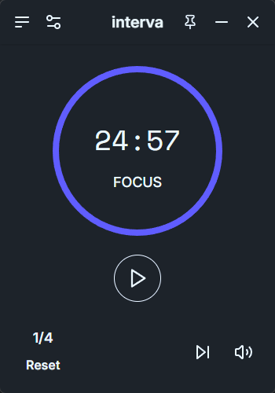
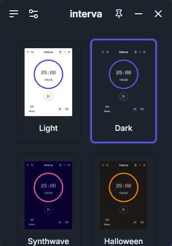
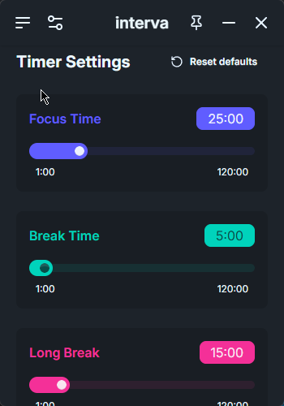

# Interva

I've built this project as a modern, customizable Pomodoro timer application that can help anyone stay focused and maintain a healthy work-study rhythm with its sleek interface.

Originally, this project was only going to be added to my portfolio for recruiters. However, after finishing the app, I decided to keep it open source and available for anyone to download.
Whether you're a student who has trouble focusing on their work, a recruiter who's looking for hirees or you just want to test this app out and contribute to it, this is the place for you :)

[https://interva-chaosweasl.vercel.app/](https://interva-chaosweasl.vercel.app/)

## Authors

- [@chaosweasl](https://github.com/chaosweasl)

# Features

- 🎯 Customizable Focus & Break Timers
- 🎨 35+ Beautiful Themes
- 🔊 Variety of Sound Effects
- ⚙️ Configurable Settings
- 🔄 Auto-start next timer
- 🎵 Volume Control
- 🖥️ Lightweight Desktop App
- 🔄 Auto Updates

---

## Download

You can download the latest version of Interva from the [GitHub Releases page](https://github.com/chaosweasl/interva/releases/latest).

### Windows

- `.msi` installer

### macOS

- `.dmg` disk image

### Linux

- `.AppImage` executable

---

## Installation via Winget

For Windows users, you can install Interva using [winget](https://learn.microsoft.com/en-us/windows/package-manager/winget/):

```bash
winget install chaosweasl.interva
```

---

## Screenshots

<table>
<tr>
<td align="center">
    
</td>
<td align="center">
    
</td>
</tr>
<tr>
<td align="center">
    
</td>
<td align="center">
    
</td>
</tr>
</table>

---

## FAQ

**Is it a virus?**

No. The app is fully open-source. You can check the code yourself if you don't take my word for it.

**Why does my computer flag the app as a virus then?**

I need a code signing certificate for Windows and macOS, which costs money. :(

**My browser flags the `.msi` file as a virus and doesn't let me download it, what should I do?**

Try disabling some security settings in your browser (e.g., Safe Browsing in Chrome). If that doesn't work, you can also try turning off real-time protection in your antivirus temporarily.

**Windows Defender warns me about the app being a potential threat and won't let me run it. How do I bypass this?**

Click on "More info" and then on "Run anyway."

**macOS says that the app is corrupted and can't be opened. How can I get around this?**

Run the following command to install the app:

```bash
sudo xattr -rd com.apple.quarantine "/Users/(your username)/Downloads/interva_1.2.0_aarch64.dmg"
```

Replace `(your username)` with your actual macOS username.

---

### What's the point of this application?

The Pomodoro Technique is a time management method that uses a timer to break work into focused intervals (typically 25 minutes) separated by short breaks. Interva takes this concept and adds:

## Cozy design:

- Distraction-Free Interface: A clean, minimal design that stays out of your way
- Customization: Adjust focus time, break durations, and number of rounds to match your workflow
- Visual Comfort: Choose from 35+ beautiful themes to match your setup or mood
- Audio Cues: Gentle sound effects to signal transitions without being disruptive

## Smart Features:

- Auto-start next sessions (configurable)
- Optional ticking sound for ambient focus
- Long break rewards after completing your rounds
- Volume control for all sound effects

---

### Will it be available on Android and iOS?

Not in the near future, and unlikely if the app ends up in the Github repository graveyard.

--- 

### Will it be available on app stores?

No. It costs money. I don't have dabloons to spare. (although it might happen if you donate on my Ko-Fi :D)

--- 

## Support

For support, you can find my email on [my Github profile](https://github.com/chaosweasl).

---

## Feedback

You can leave your feedback on [this Google Form](https://docs.google.com/forms/d/e/1FAIpQLSdaQUubBlTNOk8SC8pRLVXGEYHR99KCq-QJsast49FR15m26g/viewform)

---

## ☕ Supporting my work

Projects like these take a lot of time to make, and I don't make anything from them. 
I have a big dream of creating my own startup to help students study more efficiently - your contribution would be heart-melting to me. ❤️

[Please support me on Ko-Fi!](https://ko-fi.com/chaosweasl)

---

# For Recruiters

## Lessons Learned

One of the biggest challenges I faced while building this app was setting up workflows to streamline the deployment process. I wanted to avoid manually adding assets for each new build, so implementing GitHub Actions became essential—especially to ensure the Tauri auto-updater worked properly.

With no prior experience in CI/CD, I spent around 5–6 hours learning and configuring these workflows. While they’re not perfect, I’m proud of getting them up and running. This experience gave me a solid starting point and much more confidence in creating automation pipelines for future projects. I’ll definitely be applying these skills again.

Another challenge I faced was configuring the app to support specific OS-level behaviors, such as keeping the window always on top and building a custom draggable navbar instead of using the default title bar.

I also managed to make a landing page for my app. I built it with Next.js and Vercel, and you can visit it [here](https://interva-chaosweasl.vercel.app/). Developing the landing page was surprisingly a lot easier than I expected initially. I also learned how to add stuff like robots.txt, sitemap.xml and metadata to fully optimise SEO.

Overall, this project helped me push past a major fear: building and deploying a real-world app. Shipping something functional and available to users gave me a huge confidence boost.

---

## Tech Stack

### React, React Router, Tailwind CSS, DaisyUI, Lucide React, Vite, TypeScript, Tauri
### Vercel, Next.js, ShadCN (for the landing page)

---

## License

[MIT](https://choosealicense.com/licenses/mit/)
